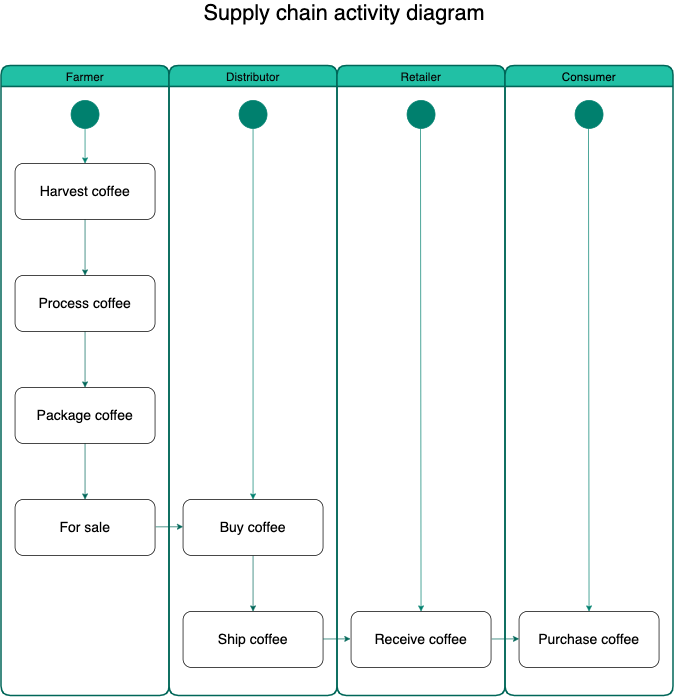

# Supply chain & data auditing

This repository containts an Ethereum DApp that demonstrates a Supply Chain flow between a Seller and Buyer. The user story is similar to any commonly used supply chain process. A Seller can add items to the inventory system stored in the blockchain. A Buyer can purchase such items from the inventory system. Additionally a Seller can mark an item as Shipped, and similarly a Buyer can mark an item as Received.

The DApp User Interface when running should look like...


## Requirement 1 (UML Daiagrams)




### Libaries

```
  "dependencies": {
    "truffle": "^5.3.8",
    "truffle-assertions": "^0.9.2",
    "truffle-hdwallet-provider": "^1.0.17",
    "web3": "^1.3.6"
  }
```
I used truffle for developing my DApp locally
I used truffle assertions for testing my contract
I used truffle hdwallet provider as my provider when deploying my contract
I used web3 to interact with my contract

### Contract address

```
1_initial_migration.js
======================

   Deploying 'Migrations'
   ----------------------
   > transaction hash:    0x33415bc5a2652f671051ad551504959cd8bc48f0d45c54d48e06f7163c2876cf
   > Blocks: 2            Seconds: 17
   > contract address:    0x9eD8A7f8b5947F284060520dED0B260d54D3c024
   > block number:        8739369
   > block timestamp:     1623326658
   > account:             0x081D87c859354f5b81dB20730Cf190A78c688083
   > balance:             18.72199535
   > gas used:            226537 (0x374e9)
   > gas price:           10 gwei
   > value sent:          0 ETH
   > total cost:          0.00226537 ETH

   Pausing for 2 confirmations...
   ------------------------------
   > confirmation number: 1 (block: 8739370)
   > confirmation number: 2 (block: 8739371)

   > Saving migration to chain.
   > Saving artifacts
   -------------------------------------
   > Total cost:          0.00226537 ETH
```

```
2_deploy_contracts.js
=====================

   Deploying 'FarmerRole'
   ----------------------
   > transaction hash:    0xfb6f747fe4c134cc1d535f7b863f587ca0423828323fc90dab1756611f0faa6f
   > Blocks: 2            Seconds: 21
   > contract address:    0x40a97807Cb4494AA9Aa9eEEe462Ee1BC37D8D7fc
   > block number:        8739374
   > block timestamp:     1623326733
   > account:             0x081D87c859354f5b81dB20730Cf190A78c688083
   > balance:             18.71847088
   > gas used:            306684 (0x4adfc)
   > gas price:           10 gwei
   > value sent:          0 ETH
   > total cost:          0.00306684 ETH

   Pausing for 2 confirmations...
   ------------------------------
   > confirmation number: 1 (block: 8739375)
   > confirmation number: 2 (block: 8739376)

   Deploying 'DistributorRole'
   ---------------------------
   > transaction hash:    0x7876828e0514eb93fa56ef8fae49a18c448710abae87373ca922e84e74c0469f
   > Blocks: 1            Seconds: 13
   > contract address:    0xeE1d403c5BAedD7A5489e5007fC63fbef0a4a2f7
   > block number:        8739377
   > block timestamp:     1623326778
   > account:             0x081D87c859354f5b81dB20730Cf190A78c688083
   > balance:             18.71540416
   > gas used:            306672 (0x4adf0)
   > gas price:           10 gwei
   > value sent:          0 ETH
   > total cost:          0.00306672 ETH

   Pausing for 2 confirmations...
   ------------------------------
   > confirmation number: 1 (block: 8739378)
   > confirmation number: 2 (block: 8739379)

   Deploying 'RetailerRole'
   ------------------------
   > transaction hash:    0x03dfa6f6012da09db639901b5b4f56793d10cb764c839300ded30fb8544bdc31
   > Blocks: 0            Seconds: 9
   > contract address:    0x0324768b059dabA8b62B9d50641fe9179767e49a
   > block number:        8739380
   > block timestamp:     1623326823
   > account:             0x081D87c859354f5b81dB20730Cf190A78c688083
   > balance:             18.71233732
   > gas used:            306684 (0x4adfc)
   > gas price:           10 gwei
   > value sent:          0 ETH
   > total cost:          0.00306684 ETH

   Pausing for 2 confirmations...
   ------------------------------
   > confirmation number: 1 (block: 8739381)
   > confirmation number: 2 (block: 8739382)

   Deploying 'ConsumerRole'
   ------------------------
   > transaction hash:    0xdf4584076d4e66e99d721a7b8ba248a74993bcc34674a9e6cb3fa3170ce98476
   > Blocks: 2            Seconds: 21
   > contract address:    0x089cC54c613120D7c7D2968cAedE9612d21E84D7
   > block number:        8739384
   > block timestamp:     1623326883
   > account:             0x081D87c859354f5b81dB20730Cf190A78c688083
   > balance:             18.70927048
   > gas used:            306684 (0x4adfc)
   > gas price:           10 gwei
   > value sent:          0 ETH
   > total cost:          0.00306684 ETH

   Pausing for 2 confirmations...
   ------------------------------
   > confirmation number: 1 (block: 8739385)
   > confirmation number: 2 (block: 8739386)

   Deploying 'SupplyChain'
   -----------------------
   > transaction hash:    0x13f9aa797a37d60685a89ddc451db50a237fc047573e7f85a13a2e52c6d5e34f
   > Blocks: 2            Seconds: 29
   > contract address:    0x412DEBb63aa78b5078fFd58C41400583d2D1378f
   > block number:        8739388
   > block timestamp:     1623326943
   > account:             0x081D87c859354f5b81dB20730Cf190A78c688083
   > balance:             18.68400248
   > gas used:            2526800 (0x268e50)
   > gas price:           10 gwei
   > value sent:          0 ETH
   > total cost:          0.025268 ETH

   Pausing for 2 confirmations...
   ------------------------------
   > confirmation number: 1 (block: 8739389)
   > confirmation number: 2 (block: 8739390)

   > Saving migration to chain.
   > Saving artifacts
   -------------------------------------
   > Total cost:          0.03753524 ETH


Summary
=======
> Total deployments:   6
> Final cost:          0.03980061 ETH
```

Change directory to ```project-6``` folder and install all requisite npm packages (as listed in ```package.json```):

```
cd project-6
npm install
```

Launch Ganache:

```
ganache-cli -m "spirit supply whale amount human item harsh scare congress discover talent hamster"
```

Your terminal should look something like this:


In a separate terminal window, Compile smart contracts:

```
truffle compile
```

Your terminal should look something like this:


This will create the smart contract artifacts in folder ```build\contracts```.

Migrate smart contracts to the locally running blockchain, ganache-cli:

```
truffle migrate
```

Your terminal should look something like this:


Test smart contracts:

```
truffle test
```

All 10 tests should pass.


In a separate terminal window, launch the DApp:

```
npm run dev
```

## Built With

* [Ethereum](https://www.ethereum.org/) - Ethereum is a decentralized platform that runs smart contracts
* [IPFS](https://ipfs.io/) - IPFS is the Distributed Web | A peer-to-peer hypermedia protocol
to make the web faster, safer, and more open.
* [Truffle Framework](http://truffleframework.com/) - Truffle is the most popular development framework for Ethereum with a mission to make your life a whole lot easier.


## Authors

See also the list of [contributors](https://github.com/your/project/contributors.md) who participated in this project.

## Acknowledgments

* Solidity
* Ganache-cli
* Truffle
* IPFS
